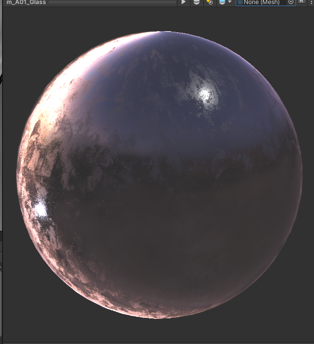

# Unity Shaders

### Bunch of shaders I use for world creation!

Created this to make a folder full of basic shaders I use for world creation. Most of these are made with Amplify editor meaning they can be edited there as well!

All shaders in this repo are Built-In pipeline compatible shaders.

## Shader List

* **HDRP Conversion Shader**
    * Cutout
    * Opaque
    * Transparent
        * This shader is meant to mimick the usage of texture maps for HDRP, makes it easy to convert HDRP materials without any effort. You can also use a tool such as [MaskMapPacker](https://github.com/uhKayla/MaskMapPacker) to create single image masks for mapping worlds when texturing is finished, this will reduce world size as there is ultimately less image maps.
        * 
        * 
* **Basic Triplanar**
    * Standard
    * Standard-Roughness
        * This is a really basic Triplanar shader, if you don't know what that is read [here](https://www.martinpalko.com/triplanar-mapping/)
        * A roughness version is included for PBR roughness maps, uses the same process as the Standard-Roughness shader
        * 
* **Standard-Roughness**
    * This is a super basic shader that converts roughness maps into smoothness maps for Unity by inverting the Roughness map within the shader. Simple stuff.
 * **Glass Refraction**
      * Basic Glass refraction including a "polarization" effect, sort of like the light splitting wavelengths through glass. It has support for Opacity and Gloss maps. I mostly based the "polerization" off of the RollTheRed glass shader using a similar posterization effect to get the look.
      * 
      * 
* **Basic Iridescence**
    * An experimental iridescence shader that creates a fake iridescence effect. I missed this from HDRP so I tried to create it in the built-in pipeline. I am still trying to figure out how to properly implement the alpha channel in the albedo so it doesnt mess with the effect, so avoid using that for now.
        * 
        * 

## Usage
Basic, just clone to your Assets directory (or use the unity package).
